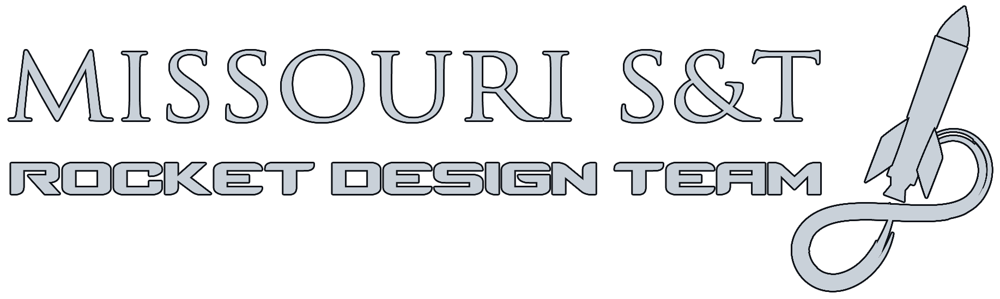

    

<em>*This repo is intended for educational purposes only*</em>

# SRAD Ground Support Equipment (GSE) Control Software
The repository containing the in-house developed control software and system documentation for the GSE of the liquid bipropellant rocket. 

## About
This project is the first iteration of the GSE System for the Rocket Design Team's (RDT) liquid bipropellant rocket.
It aims to provide basic GSE control functionality, such as controlling the nitrous oxide fill process, sending the ignition command, and relaying communications from the Liquid Engine Controller (LEC). The GSEC and system will allow a more safe, efficient, and automated launch procedure. 

## Documentation
*placeholder*

## Development 
*placeholder* 

## File Structure
This repo contains three main sections, hardware, integrationDocumentation, and firmware.

### Hardware:
The hardware directory will contain all of the files related to the design and assembly of the PCBs. This includes KiCad projects as well as BOMs. 

### integrationDocumentation:
The integrationDocumentation directory will contain all of the integration documentation to integrate the above hardware with the Raspberry Pi based GSEC

### Software: 
The software directory will contain the GSEC's control code (Python)  
